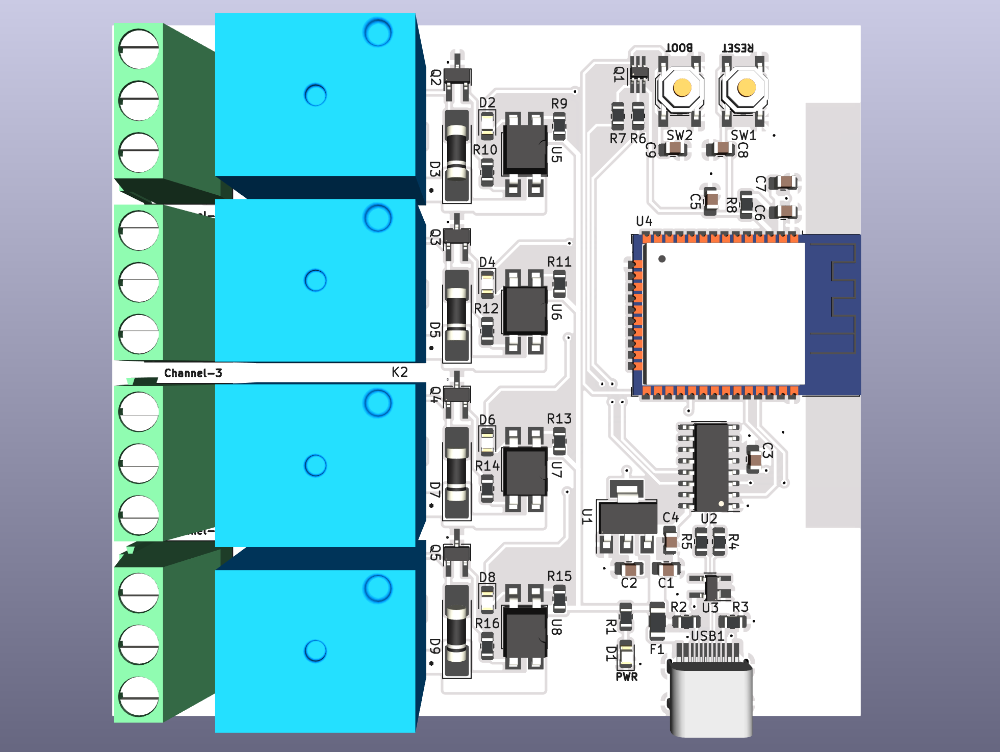
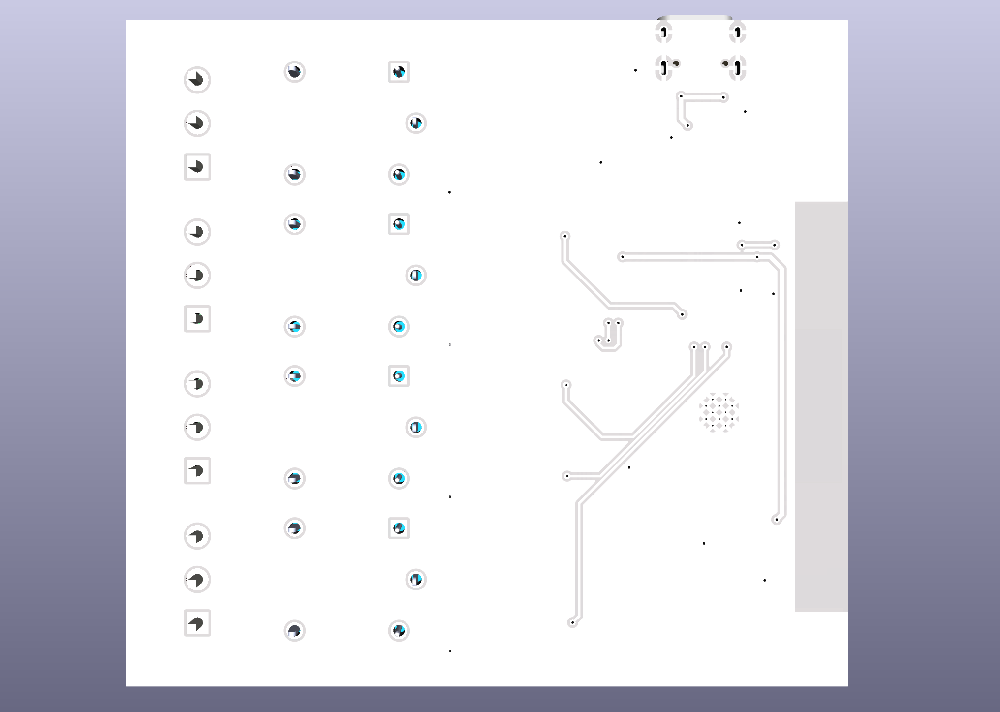
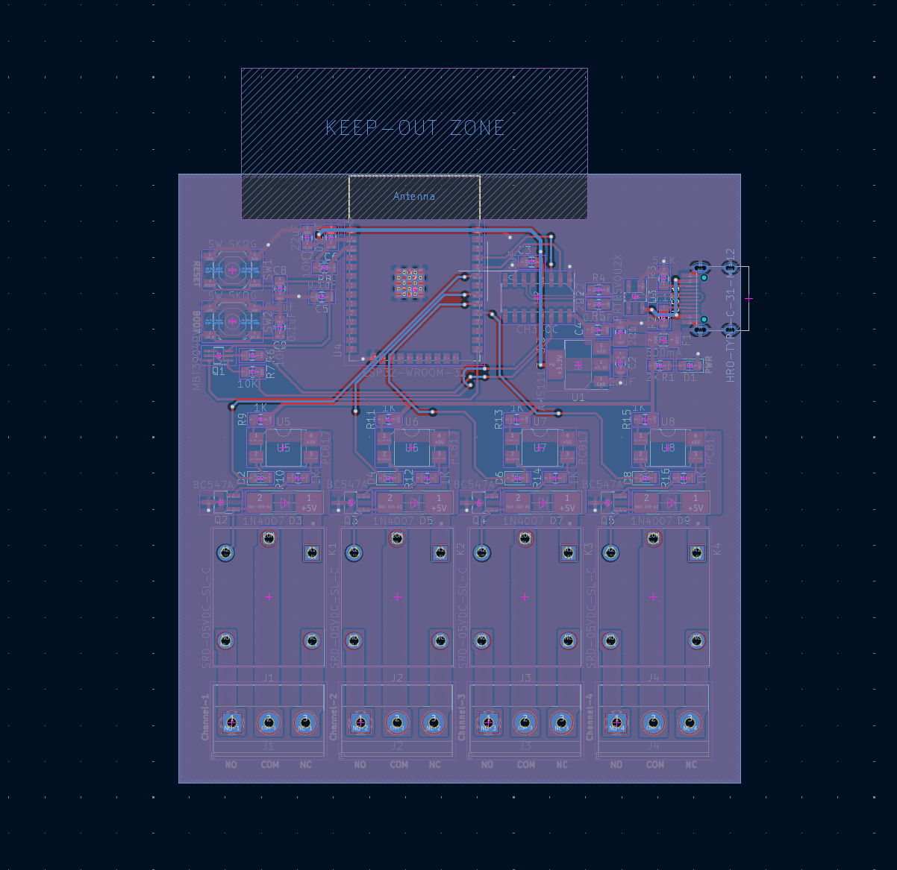

<div align="center">

# ⚡ Mạch Điều Khiển 4 Relay Cách Ly Quang Dùng ESP32 (KiCad)

Dự án thiết kế phần cứng mã nguồn mở **Mạch Điều Khiển 4 Kênh Relay sử dụng vi điều khiển ESP32-WROOM-32**, thiết kế trên phần mềm **KiCad**. Mạch tích hợp cách ly quang toàn phần (Optocoupler), cổng nạp USB Type-C tự động reset (Auto-Download), bảo vệ chống tĩnh điện ESD, cầu chì tự phục hồi PTC và rãnh cách ly an toàn điện áp cao (Creepage Slots) chuyên dụng cho nhà thông minh (Smart Home) và tự động hóa công nghiệp (IoT).

[](https://www.kicad.org/)
[](LICENSE)
[](LICENSE)
[](https://www.espressif.com/)
[](firmware/esphome/esp32_4ch_relay.yaml)

<br/>

[📖 English Version](README_EN.md) • [📑 Xem Sơ Đồ Nguyên Lý PDF](schematic.pdf) • [📊 Danh Mục Linh Kiện (BOM)](docs/BOM.md) • [📌 Sơ Đồ Chân (Pinout)](docs/PINOUT.md)

<br/>



</div>

---

## 🌟 Điểm Nổi Bật Của Thiết Kế

- 🧠 **Vi điều khiển lõi kép ESP32**: ESP32-WROOM-32 tích hợp kết nối Wi-Fi 2.4 GHz và Bluetooth LE 4.2 tốc độ cao.
- 🔌 **4 Kênh Relay độc lập**: Sử dụng Relay Songle SRD-05VDC-SL-C cho khả năng đóng cắt dòng tải lên đến **10A @ 250VAC / 10A @ 30VDC**.
- 🛡️ **Cách ly quang an toàn (Galvanic Opto-Isolation)**: Sử dụng 4 Optocoupler PC817 cách ly hoàn toàn khối vi điều khiển 3.3V với khối cuộn hút Relay 5V, chống nhiễu xung ngược khi đóng ngắt.
- ⚡ **Cổng giao tiếp USB Type-C hiện đại**: Cổng Type-C (HRO-TYPE-C-31-M-12) vừa cấp nguồn 5V vừa nạp code trực tiếp từ máy tính.
- 🔄 **Mạch tự động nạp & reset (Auto-Download)**: Tích hợp chip chuyển đổi USB-UART CH340C cùng cặp transistor MBT3904DW1 điều khiển chân `EN` và `IO0` (tự động vào chế độ nạp không cần nhấn nút thủ công).
- 🔒 **Hệ thống bảo vệ phần cứng đa lớp**:
  - Cầu chì tự phục hồi PTC 500mA (`F1`) bảo vệ quá dòng cổng USB.
  - Mảng Diode TVS PRTR5V0U2X (`U3`) triệt tiêu xung tĩnh điện ESD trên đường tín hiệu USB D+/D-.
  - Diode dập xung ngược 1N4007 (`D3, D5, D7, D9`) bảo vệ transistor khi ngắt cuộn dây relay.
  - Phay rãnh cách ly điện áp cao (Isolation Creepage Slots) giữa tiếp điểm Relay và mạch điều khiển.
- 💡 **Đèn LED hiển thị trực quan**:
  - 1 LED Vàng báo nguồn 3.3V (`D1`).
  - 4 LED Đỏ báo trạng thái kích hoạt của từng Relay (`D2, D4, D6, D8`).
- 📶 **Thiết kế anten RF tối ưu**: Khu vực Anten PCB của ESP32 được bố trí nhô ra ngoài với vùng cấm đi dây (Keep-out Zone) để tăng tối đa khoảng cách thu phát sóng Wi-Fi.

---

## 📸 Hình Ảnh Phối Cảnh & Layout PCB

<div align="center">
  <table>
    <tr>
      <td align="center"><b>Phối cảnh 3D Mặt Trước (Top View)</b></td>
      <td align="center"><b>Phối cảnh 3D Mặt Sau (Bottom View)</b></td>
    </tr>
    <tr>
      <td></td>
      <td></td>
    </tr>
    <tr>
      <td colspan="2" align="center"><b>Bản Vẽ Thiết Kế Layout 2D (KiCad PCB)</b></td>
    </tr>
    <tr>
      <td colspan="2" align="center"></td>
    </tr>
  </table>
</div>

---

## 📋 Thông Số Kỹ Thuật Chi Tiết

| Thông số | Giá trị chi tiết |
| :--- | :--- |
| **Vi điều khiển chính** | ESP32-WROOM-32 (Xtensa Dual-Core 32-bit LX6, tần số tối đa 240 MHz) |
| **Nguồn cấp đầu vào** | 5V DC qua cổng USB Type-C |
| **Điện áp hoạt động Logic** | 3.3V DC (Hạ áp qua IC AMS1117-3.3V dòng tối đa 1A) |
| **Số kênh Relay** | 4 Kênh độc lập (Tiếp điểm SPDT: NO - Thường mở, COM - Chung, NC - Thường đóng) |
| **Loại Relay** | Songle SRD-05VDC-SL-C (Cuộn hút 5V DC) |
| **Công suất tiếp điểm (AC)**| 10A 250VAC / 10A 125VAC |
| **Công suất tiếp điểm (DC)**| 10A 30VDC / 10A 28VDC |
| **Cổng kết nối tải** | 4 Domino (Terminal Block) 3 chân, bước chân chuẩn 5.08mm |
| **Cơ chế cách ly** | Optocoupler quang PC817 + Rãnh cách ly phay cơ khí trên mạch |
| **Chip nạp USB-UART** | CH340C (Tích hợp sẵn thạch anh nội dao động) |
| **Nền tảng lập trình hỗ trợ** | Arduino IDE, PlatformIO, ESP-IDF, ESPHome (Home Assistant), Tasmota |

---

## 📌 Sơ Đồ Chân (Pinout & GPIO Mapping)

| Kênh chức năng | Chân ESP32 | Mức kích hoạt | Opto cách ly | Transistor kích | LED Trạng thái | Cổng Domino ra tải |
| :--- | :---: | :---: | :---: | :---: | :---: | :--- |
| **Relay 1** | `GPIO 21` | Mức CAO (`HIGH`) | U5 (PC817) | Q2 (BC547A) | `D2` (LED Đỏ) | **J1** (NO, COM, NC) |
| **Relay 2** | `GPIO 19` | Mức CAO (`HIGH`) | U6 (PC817) | Q3 (BC547A) | `D4` (LED Đỏ) | **J2** (NO, COM, NC) |
| **Relay 3** | `GPIO 18` | Mức CAO (`HIGH`) | U7 (PC817) | Q4 (BC547A) | `D6` (LED Đỏ) | **J3** (NO, COM, NC) |
| **Relay 4** | `GPIO 5`  | Mức CAO (`HIGH`) | U8 (PC817) | Q5 (BC547A) | `D8` (LED Đỏ) | **J4** (NO, COM, NC) |
| **UART RX**  | `GPIO 3`  | - | - | - | Chân TX CH340C | Cổng nạp USB Type-C |
| **UART TX**  | `GPIO 1`  | - | - | - | Chân RX CH340C | Cổng nạp USB Type-C |
| **Nút BOOT** | `GPIO 0`  | Mức THẤP (`LOW`) | - | - | Nút nhấn `SW2` | Vào chế độ nạp thủ công |
| **Nút RESET**| `EN`      | Mức THẤP (`LOW`) | - | - | Nút nhấn `SW1` | Reset phần cứng |
| **LED Nguồn**| `+3.3V`   | Sáng liên tục | - | - | `D1` (LED Vàng) | Báo nguồn 3.3V ổn định |

👉 Xem hướng dẫn phân tích phần cứng và chân strapping chi tiết tại: [docs/PINOUT.md](docs/PINOUT.md).

---

## 🗂️ Cấu Trúc Thư Mục Dự Án

```text
.
├── esp32-4-channel-relays.kicad_pro   # File Project KiCad (v7 / v8 / v10)
├── esp32-4-channel-relays.kicad_sch   # File Sơ đồ nguyên lý (Schematic)
├── esp32-4-channel-relays.kicad_pcb   # File Thiết kế mạch in (PCB Layout)
├── schematic.pdf                      # Bản xuất sơ đồ nguyên lý định dạng PDF
├── images/                            # Ảnh render 3D và sơ đồ layout PCB
│   ├── board_3d_top.png               # Phối cảnh 3D mặt trước
│   ├── board_3d_bottom.png            # Phối cảnh 3D mặt sau
│   └── pcb_layout_2d.png              # Bản vẽ layout PCB 2D
├── lib/                               # Thư viện linh kiện KiCad riêng của dự án
│   ├── 3dmodel/                       # Mô hình 3D CAD (.step, .wrl)
│   ├── footprint/                     # Thư viện Footprint chân linh kiện (.kicad_mod)
│   └── symbol/                        # Thư viện Symbol ký hiệu nguyên lý (.kicad_sym)
├── docs/                              # Tài liệu kỹ thuật dự án
│   ├── BOM.md                         # Bảng danh mục linh kiện (Markdown)
│   ├── BOM.csv                        # Danh mục linh kiện (File CSV)
│   └── PINOUT.md                      # Bảng tra cứu sơ đồ chân phần cứng
├── firmware/                          # Mã nguồn mẫu sẵn sàng nạp
│   ├── arduino/esp32_4ch_relay_web/   # Code Arduino Web Server + REST API điều khiển Relay
│   └── esphome/esp32_4ch_relay.yaml   # Cấu hình ESPHome nạp vào Home Assistant
├── .github/                           # GitHub Actions CI kiểm tra file & mẫu Issue
├── .gitignore                         # Bộ lọc file rác, file tạm của KiCad
├── CONTRIBUTING.md                    # Hướng dẫn đóng góp phát triển dự án
├── LICENSE                            # Giấy phép mã nguồn mở CERN-OHL-P v2 & MIT
├── README_EN.md                       # Tài liệu tiếng Anh (English documentation)
└── README.md                          # Tài liệu hướng dẫn chính (Tiếng Việt)
```

---

## 🚀 Hướng Dẫn Nạp Firmware & Sử Dụng

### 1. Điều khiển qua Web & Serial bằng Arduino IDE
Mã nguồn mẫu hoàn chỉnh có sẵn tại thư mục [`firmware/arduino/esp32_4ch_relay_web/`](firmware/arduino/esp32_4ch_relay_web/esp32_4ch_relay_web.ino).

1. Cài đặt **Arduino IDE** và cài board **ESP32 by Espressif**.
2. Mở file `esp32_4ch_relay_web.ino`.
3. Điền thông tin Wi-Fi nhà bạn:
   ```cpp
   const char* WIFI_SSID = "TEN_WIFI_CUA_BAN";
   const char* WIFI_PASS = "MAT_KHAU_WIFI";
   ```
4. Cắm cáp USB Type-C từ máy tính vào mạch, chọn cổng COM và bấm **Upload** (Mạch có tính năng tự động nạp code không cần giữ nút BOOT).
5. Mở trình duyệt web truy cập vào: `http://esp32-relay.local` hoặc địa chỉ IP hiển thị trên Serial Monitor để điều khiển bật/tắt 4 relay.

### 2. Tích hợp trực tiếp vào Home Assistant qua ESPHome
Dự án đã chuẩn bị sẵn file cấu hình [`firmware/esphome/esp32_4ch_relay.yaml`](firmware/esphome/esp32_4ch_relay.yaml).

1. Cài đặt [ESPHome](https://esphome.io/) trên máy tính hoặc Add-on trong Home Assistant.
2. Nạp file cấu hình qua USB bằng lệnh:
   ```bash
   esphome run firmware/esphome/esp32_4ch_relay.yaml
   ```
3. Sau khi nạp xong, Home Assistant sẽ tự động nhận diện thiết bị và tạo sẵn 4 công tắc tương ứng với 4 kênh relay.

---

## ⚠️ Cảnh Báo An Toàn Điện Áp Cao (220V AC)

> [!WARNING]
> **CẢNH BÁO AN TOÀN ĐIỆN NGUY HIỂM**: Đóng cắt điện lưới xoay chiều 220V AC tiềm ẩn nguy cơ giật điện và hỏa hoạn nghiêm trọng.
> - Luôn ngắt toàn bộ nguồn điện trước khi đấu nối dây điện vào cọc Domino (Terminal Block).
> - Khi đóng cắt tải điện 220V, bắt buộc phải đặt mạch trong hộp bảo vệ cách điện (nhựa chống cháy, in 3D kín).
> - Đảm bảo dòng điện tải thực tế không vượt quá định mức của tiếp điểm Relay và đường mạch đồng.

---

## 📦 Danh Mục Linh Kiện (BOM)

Toàn bộ thông tin chi tiết về linh kiện (Package SMD 0805 dễ hàn tay, chân cắm THT, mã IC):
- 📄 [Xem Bảng Tra Linh Kiện BOM (Markdown)](docs/BOM.md)
- 📊 [Tải File Excel/CSV BOM (docs/BOM.csv)](docs/BOM.csv)
- 📑 [Xem Bản Vẽ Sơ Đồ Nguyên Lý PDF](schematic.pdf)

---

## 📄 Bản Quyền & Tác Giả

- **Thiết kế phần cứng**: Cấp phép theo chuẩn phần cứng mở **[CERN-OHL-P v2](https://cern-ohl.web.cern.ch/)** (CERN Open Hardware Licence Version 2 - Permissive).
- **Mã nguồn phần mềm & Tài liệu**: Cấp phép theo chuẩn **[MIT License](LICENSE)**.
- **Tác giả thiết kế**: **Phan Huỳnh Văn Đô** (`2023 - 2026`).
